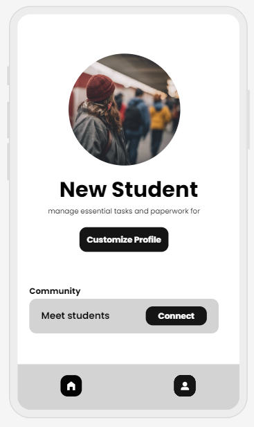

# Project Title
Maple Roots

## Overview

Maple Roots is a spot for new students in Canada to get guidance and help with resources and information as they plant their roots in the country.

### Problem Space

A lot of young people take on the huge challenge to move away from their family and their comfort zones to come to Canada in search of better education and internationally accepted degrees. A lot of them arrive as young adults and have to figure out the new life, new country, new way of learning on their own and they also to face the extra step of setting themselves up correctly in the country so they can fully focus on their studies. Unfortunately, many students miss out or find out late about some of the resources available to them due to lack of information. So Maple Roots aims to bring the resources, information and solutions right to their fingertips so they can feel less overwhelmed.

### User Profile

-Students:
    - looking to know what steps to take to get setup in the country
    - looking for resources they might have not taken advantage of in the past.

### Features

- As a user, i want to be able to know the first steps i should take as a new student in the country
- As a user, i want to keep track of the steps i have already completed.
- As a user, i want to have a single location that can direct me to where i can find more information about a resource.
- As a user, i want to be able to specify my school

## Implementation

### Tech Stack989

- React
- MySQL
- Express
- Client libraries: 
    - react
    - react-router
    - axios
- Server libraries:
    - knex
    - express

### APIs

- No external APIs will be used for the first sprint

### Sitemap

- Welcome page
- Onboarding
- Home page
- User profile

### Mockups

### Data

### Endpoints

POST /api/users
Description: Create a new user.
Parameters: name, school
Response:

{
  "name": "John Doe",
  "school": "ABC University"
}

GET /api/users/
Description: Get a user
Parameter: id (User ID)
Response: 

{ 
    "id": 1
    "user_id": 1, 
    "name": "John Doe",   
    "school": "Dalhousie University" 
}

PUT /api/users/
Description: update a user by their id
Parameter: id, updatedUser

{
    "name": "Jane Doe",
    "school": "XYZ University"
}

GET /api/resources
Description: Get resources based on school.
Parameter: school
Response: 

[ 
    { 
        "id": 1, 
        "resource": "Information about health insurance", 
        "link": "https://insurance.com" 
    } 
]

PUT /api/resources
Description: Get resources based on school.
Parameter: school

{
  "resource": "Get your health card",
  "link": "www.healthcard.com",
  "completed": true
}

POST /api/resources
Description: Add a new resource.
Parameter: newResource, link

{
  "resource": "Find a doctor",
  "link": "www.findadoctor.com"
}

DELETE /api/resources
Description:Delete a resource by ID.
Parameter: id

## Roadmap

-Create client
    -react project with routes and boilerplate pages

-Create server
    - express project with routing

- Setup all the assets and typography, remote repo

-Gather information based on the schools and their location in city.

-Gather all the initial data about the resources the site would need

-Feature: Welcome page

-Feature: List the resources based on the school
    - implement the list of all the resources for the user
    - implement the ability to check mark the resources that are completed

-Feature: User profile

-Feature: Onboarding

-Feature: Homepage
    -implement user profile icon to link to user profile
    -implement the list of steps according to order
    - implement done button on each step and show checkmark

---

## Future Implementations

-add a change profile picture feature
-add a join the community feature to connect the user to other students.

-Feature: Notifications
    - Implement hide and show notifications option

